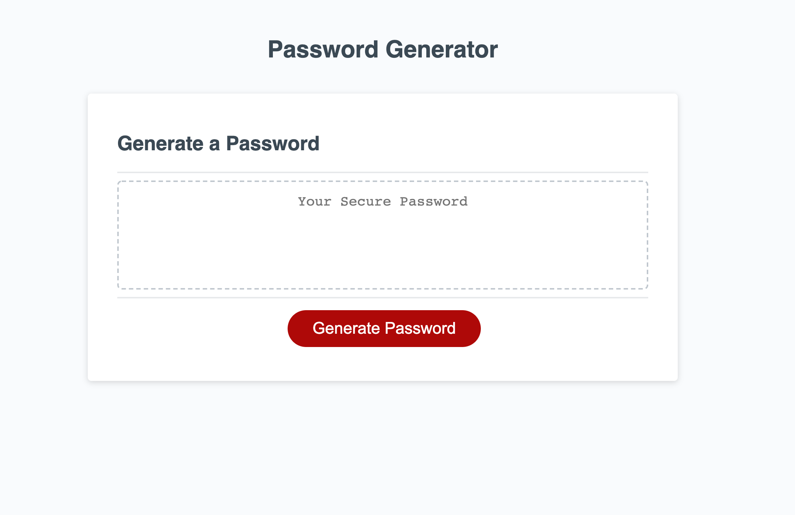

# Random Password Generator

## Purpose

A website that generates a random password that meets certain criteria selected by the user. The password that is generated is strong and provides greater security.

The site's criteria includes:

- When clicking the button to generate a password, the user is presented with a series of prompts for password criteria.
- The user is able to select or reject criteria to include in their password.
- Users are able to create a password between 8 and 128 characters long.
- They can choose to include lowercase, uppercase, numeric, and/or special characters in their password.
- When all prompts are answered, a password is generated that matches the selected criteria in the password box.

### **Website Link:**

https://rachealcolbert.github.io/password-generator

## Built With

- HTML
- CSS
- JavaScript

## Website

https://rachealcolbert.github.io/password-generator

## Contribution

Made with ❤️ by Racheal Colbert
